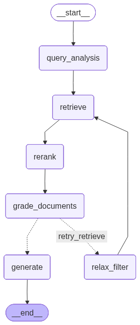

# FinanceBench RAG Eval

A production-grade Retrieval-Augmented Generation system evaluated against the [FinanceBench](https://github.com/patronus-ai/financebench) benchmark (Patronus AI). Built with rigorous multi-tier eval, end-to-end observability, and full public documentation of the iteration process — including what failed and why.


---

## Why financial domain

- Public dataset with ground truth — objective, measurable progress
- Numerical precision is critical — forces serious eval, no vibe checks
- Benchmarks are published — results are directly comparable to state of the art
- High enterprise signal for international recruiters

---

## Architecture

### Phase 4 — CRAG Pipeline (current)



```
Query
  ↓
query_analysis  — LLM extracts company + year → filter token (e.g. 3M_2018)
  ↓
retrieve        — Hybrid retrieval (dense + BM25, top-k=15) with Qdrant pre-filter
  ↓
rerank          — CrossEncoder (BAAI/bge-reranker-base), top-10
  ↓
grade_documents — LLM grades retrieved context: RELEVANT | IRRELEVANT
  ↓ (if IRRELEVANT and retry_count=0)
relax_filter    — drops company/year filter, retries with full corpus
  ↓ (if RELEVANT or retry_count≥1)
generate        — GPT-4o answers from graded context
  ↓
Answer + Sources
```

> **Note:** GPT-4o used for final eval after GPT-4o-mini proved to be the generation bottleneck (~47% → ~57% accuracy).

### Phase 1–3 — Simple Agent (deprecated)

```
Query → Metadata Filter → Hybrid Retrieval → LangGraph Agent (tool use loop) → Response
```

All LLM calls traced end-to-end via LangSmith.

---

## Stack

| Component       | Tool                              | Reason                                          |
|-----------------|-----------------------------------|-------------------------------------------------|
| LLM             | GPT-4o                            | GPT-4o-mini was generation bottleneck; 4o improved accuracy +10pp |
| Embeddings      | text-embedding-3-small            | Simple, cheap, strong baseline                  |
| Sparse          | BM25 (FastEmbedSparse)            | Exact number matching, hybrid fusion via RRF    |
| Vector DB       | Qdrant (local via Docker)         | Open source, production-ready, hybrid search    |
| Orchestration   | LangGraph (`StateGraph`)          | CRAG pipeline: grade → relax filter → generate  |
| Reranker        | BAAI/bge-reranker-base (CrossEncoder) | Reranks top-15 → top-10 before grading      |
| Observability   | LangSmith                         | Traces, cost tracking                           |
| Eval            | Custom multi-tier                 | Full control, calibrated against human labels   |

---

## Eval Framework

### Tier 1 — Retrieval

| Metric       | Description                                          |
|--------------|------------------------------------------------------|
| Recall@6     | Fraction of queries where correct doc is in top-6   |
| Precision@6  | Fraction of retrieved chunks from the correct doc    |
| MRR          | Mean Reciprocal Rank of first correct chunk          |

### Tier 2 — Generation (LLM-as-Judge, scale 1–5)

| Metric               | Notation | Description                                                  |
|----------------------|----------|--------------------------------------------------------------|
| Context Relevance    | C\|Q     | Retrieved chunks address the query                           |
| Answer Faithfulness  | A\|C     | Answer grounded in retrieved context (hallucination check)   |
| Answer Relevance     | A\|Q     | Answer addresses the original question                       |
| Answer Correctness   | A\|GT    | Answer matches the ground truth expected answer              |

**Judge calibration:** every judge validated against 30 human-labeled examples. TPR and TNR reported. Without calibration, eval is theater.

**Judge v2 (stricter):** A|GT prompt enforces numerical extraction + tolerance rules. Numbers >15% off ground truth score ≤ 2 regardless of reasoning quality. TNR improved from 0.75 → 0.94.

---

## Results

### Tier 1 — Retrieval

| Phase | Setup | Recall@6 | Precision@6 | MRR | Misses |
|-------|-------|----------|-------------|-----|--------|
| Phase 02 | Dense only, no filter | 0.830 | 0.422 | 0.646 | 17 |
| Phase 03 | Hybrid + company filter | 0.840 | 0.405 | 0.594 | 16 |
| Phase 03b | Hybrid + company+year filter + full corpus | **0.940** | **0.406** | **0.630** | **6** |
| Phase 04 | CRAG + rerank + contextual prefix + GPT-4o | 0.950 | 0.427 | 0.578 | 5 |

### Tier 2 — Generation

| Phase | C\|Q | A\|C | A\|Q | A\|GT | Correct (judge) | Correct (human-calibrated) |
|-------|------|------|------|-------|-----------------|---------------------------|
| Phase 02 | — | 3.30 | 4.29 | 3.19 | 53/100 | ~47/100 |
| Phase 03 | — | 4.08 | — | 3.39 | 58/100 | — |
| Phase 03b | 3.87 | **4.49** | **4.43** | **3.61** | 63/100 (v1) / 51/100 (v2) | **~47/100** |
| Phase 04 | — | — | — | 3.02 | 47/100 (v2) | ~57/100 |

### Judge Calibration (30 human labels)

| Judge | TPR | TNR | False Positives | Notes |
|-------|-----|-----|-----------------|-------|
| v1 (Phase 02) | 1.00 | 0.86 | 3/30 | Used in Phase 02 baseline |
| v1 (Phase 03b) | 0.93 | 0.75 | 4/30 | Fluency bias: approves wrong numbers |
| **v2 (Phase 03b)** | 0.71 | **0.94** | **1/30** | Strict numerical tolerance enforced |
| v2 (Phase 04, GPT-4o) | 0.82 | 0.92 | — | Final calibration with GPT-4o generation |

**Key finding:** Judge v1 inflated "correct" count by +16/100 (63 nominal vs 47 human-calibrated). v2 reduces inflation to +4 — but trades off some TPR.

---

## Key Findings

1. **Corpus completeness is the biggest lever.** 5 missing PDFs (never ingested) caused 10 retrieval misses. Fixing this alone added +10pp Recall@6. Retrieval can't work without the document.

2. **Hybrid retrieval (dense + BM25) improved faithfulness, not recall.** A|C jumped +0.78 (3.30 → 4.08) because BM25 finds exact number matches. MRR dropped slightly — dense-only had better rank precision for some queries.

3. **Company+year metadata filtering resolved cross-company confusion.** Filtering by `ADOBE_2022` instead of just `ADOBE` prevents older filings from outranking the correct year.

4. **LLM-as-Judge has strong fluency bias without calibration.** Judge v1 gave 5/5 to an answer with quick ratio 1.76 when ground truth was 1.57. Prompt engineering (v2) with explicit numerical extraction cuts false positives from 4 → 1 in 30 samples.

5. **Real accuracy (~47%) is lower than nominal judge score (63%).** Always calibrate against human labels. The gap is the fluency bias: well-explained wrong numbers look correct to a judge without strict numerical rules.

6. **Generation model is the real bottleneck.** Retrieval improved from 83% to 95% recall with no accuracy gain (~47%). Switching generation from GPT-4o-mini to GPT-4o raised human-calibrated accuracy from ~47% to ~57%. The model matters more than the retrieval pipeline for numerical precision.

---

## Cost per Query (Phase 04)

Measured from LangSmith traces over the 100-query eval run (GPT-4o generation).

| Metric | Value |
|--------|-------|
| Avg cost | $0.017/query |
| Total cost (100 queries) | ~$1.74 |
| Avg latency | 40.7s |
| Latency range | 9s – 88s |
| Avg tokens | ~6,900/query |

---

## Failure Mode Distribution (Phase 03b)

| Mode | Count | Root Cause |
|------|-------|-----------|
| Retrieval miss | 6 | Doc not in top-6 despite being in corpus |
| Numerical error | ~15 | Model retrieves right doc, calculates wrong value |
| Incomplete | ~12 | Partial answer, misses key sub-question |
| Hallucination | ~8 | Answer not grounded in retrieved context |
| Agent timeout | ~5 | Recursion limit hit before answer produced |
| Correct | ~47 | — |

---

## Roadmap

- [x] **Phase 1** — Functional baseline (weeks 1–3)
  - [x] Dataset: FinanceBench, 84 PDFs, 27,462 chunks in Qdrant
  - [x] Fixed chunking (512 tokens, overlap 50)
  - [x] Dense retrieval (text-embedding-3-small) + GPT-4o-mini
  - [x] Initial eval: 20 queries, cross-company retrieval identified as primary failure
- [x] **Phase 2** — Eval infrastructure (weeks 4–6)
  - [x] 100-query eval set with ground truth
  - [x] Tier 1: Recall@6, Precision@6, MRR
  - [x] Tier 2: LLM-as-Judge (C|Q, A|C, A|Q, A|GT)
  - [x] Judge calibrated against 30 human labels (TPR/TNR reported)
  - [x] Baseline: Recall@6=0.830, 53/100 correct (judge), ~47/100 (human)
- [x] **Phase 3** — Error analysis + iteration (weeks 7–9)
  - [x] Failure mode classification (wrong_doc, retrieval_miss, hallucination, etc.)
  - [x] Fix 1: Hybrid retrieval — dense + BM25 (FastEmbedSparse), RRF fusion
  - [x] Fix 2: Metadata filtering — LLM extracts company+year → Qdrant pre-filter
  - [x] Corpus audit: 5 missing PDFs found and ingested (EDGAR HTM fallback)
  - [x] Phase 03b: Recall@6=0.940, 6 retrieval misses remaining
  - [x] Judge v2: strict numerical tolerance, TNR 0.75 → 0.94
  - [x] Human recalibration: real accuracy ~47/100 vs 63/100 nominal
- [ ] **Phase 4** — CRAG pipeline + contextual retrieval (weeks 10–12)
  - [x] CRAG pipeline: query_analysis → retrieve → rerank → grade → relax_filter → generate
  - [x] Reranker: BAAI/bge-reranker-base (CrossEncoder) replacing ms-marco (wrong domain)
  - [x] Contextual retrieval prefix: `Company: X | Document: Y | Year: Z` prepended to every chunk
  - [x] FinanceBench_v2 collection: 84 docs, 27k+ chunks, full corpus coverage
  - [x] HTM support in ingestion (J&J and KraftHeinz filings from SEC EDGAR)
  - [x] Codebase refactored: nodes/, chains/, prompts/, state.py, graph.py
  - [x] **4.1** Eval completo pipeline novo — 100 queries, compare Phase03b vs Phase04
  - [ ] **4.2** Dense vs hybrid — desliga BM25, roda 100 queries, decide qual manter
  - [x] **4.3** Recalibra judge — 30 human labels, TPR=0.82, TNR=0.92, accuracy ~57%
  - [x] **4.4** Eval final comparativo — tabela: Baseline → Phase03 → Phase03b → Phase04
  - [x] **4.5** Custo por query — $0.017/query, ~$1.74 total, 40.7s latência média, ~6,900 tokens/query
  - [ ] **4.6** Demo — Streamlit ou HF Spaces
  - [ ] **4.7** README final — diagrama arquitetura, resultados, como reproduzir
  - [ ] **4.8** Post 3 + LinkedIn — "From X% to Y% Accuracy on FinanceBench"

---

## Getting Started

### Prerequisites

- Python 3.11+
- Docker
- `OPENAI_API_KEY`

### Install

```bash
git clone https://github.com/joaopaulotr/financebench-rag-eval
cd financebench-rag-eval
uv sync
```

### Environment

```bash
cp .env.example .env
# fill OPENAI_API_KEY
```

### Run Qdrant

```bash
docker compose up -d
```

### Ingest documents

```bash
uv run python ingestion.py
```

### Run a query (Phase 4 — CRAG pipeline)

```bash
cd backend/CoreRefactoryLangGraph
uv run python main.py
```

### Run a query (Phase 1–3 — legacy)

```bash
uv run python backend/core.py
```

### Run eval (Phase 03b)

```bash
uv run python eval/Phase03/runBaseline_b.py     # retrieval + generation (100 queries)
uv run python eval/Phase03/runJudge_b_v2.py     # strict numerical judge scoring
uv run python eval/Phase03/report_b.py          # comparative report
uv run python eval/Phase03/calibrate_v2.py      # v1 vs v2 judge calibration
```

---

## Run with Docker (full stack)

Brings up Qdrant (always-on), the FastAPI streaming API, and the web UI in one command:

```bash
docker compose up -d --build
# qdrant → :6333  ·  api → :8000  ·  web (chat UI) → :5173
```

- The `api` container waits for Qdrant before starting (no boot race) and persists downloaded models in a `model_cache` volume.
- Set `OPENAI_API_KEY` in `.env` at the repo root before `up` — it is passed to the API container.

**Ingest the corpus once** (populates the `FinanceBench_v2` Qdrant collection — required before any query returns results). The `qdrant_data` volume persists it across restarts, so this is a one-time step:

```bash
docker compose up -d qdrant      # Qdrant alone is enough for ingestion
uv run python ingestion.py       # connects to localhost:6333
```

**Frontend dev (hot reload):** the `web` container serves a production build (for demo/deploy). For local development with hot reload, run Vite directly instead:

```bash
cd frontend && npm install && npm run dev   # http://localhost:5173 → API at :8000
```

---

## Deploy (Railway)

Railway runs one container per service (no `docker-compose`), so deploy three services in the same project:

| Service | Source | Notes |
|---------|--------|-------|
| `qdrant` | Docker image `qdrant/qdrant` | Attach a volume at `/qdrant/storage` to persist the collection |
| `api` | `Dockerfile.backend` | Env: `OPENAI_API_KEY`, `QDRANT_URL=http://<qdrant-private-host>:6333`. Attach a volume at `/root/.cache` for model weights |
| `web` | `frontend/Dockerfile` | Build-time env `VITE_API_URL=https://<api-public-url>` — baked into the bundle, so set it **before** the build |

Steps: create the project → add the three services → set env vars (use Railway private networking for `QDRANT_URL`) → run `ingestion.py` once against the deployed Qdrant to populate `FinanceBench_v2`.

> **Note:** `VITE_API_URL` is read in the browser, so it must be the API's **public** URL, not the private one.

---

## Codebase Structure (Phase 4)

```
backend/CoreRefactoryLangGraph/
  state.py              # RAGState TypedDict (query, filter_token, context, sources, grade, answer, retry_count)
  graph.py              # StateGraph definition — nodes, edges, compile()
  main.py               # Entry point — run(query) → {answer, sources, context}
  tools.py              # Infrastructure — model, vectorstore (Qdrant), reranker (CrossEncoder)
  nodes/
    query_analysis.py   # LLM extracts company+year → filter_token
    retrieve.py         # Hybrid retrieval with Qdrant pre-filter + fallback
    rerank.py           # CrossEncoder reranking, top-10
    grade.py            # Calls grade_chain, returns RELEVANT|IRRELEVANT
    generate.py         # Final answer generation with graded context
    router.py           # should_retry() + relax_filter()
  chains/
    grade.py            # grade_chain = GRADE_PROMPT | model.with_structured_output(DocumentGrade)
  prompts/
    analyst.py          # ANALYST_SYSTEM_PROMPT
    filter.py           # QUERY_FILTER_SYSTEM
    grader.py           # GRADE_PROMPT (ChatPromptTemplate)
```

### Qdrant Collections

| Collection | Chunks | Docs | Notes |
|---|---|---|---|
| `FinanceBench` | 27,462 | 79 | Original — no contextual prefix, missing 5 HTM docs |
| `FinanceBench_v2` | ~27,200 | 84 | Contextual prefix + full corpus (all 84 docs) |

---

## Eval Output Files

```
eval/
  Phase02/
    results_100.csv                      # Phase 02 baseline results
    results_with_judge.csv               # Phase 02 judge scores
    human_labels_30.csv                  # 30 human labels for calibration
  Phase03/
    results_phase3b.csv                  # Phase 03b results (full corpus + fixes)
    results_phase3b_with_judge_v2.csv    # Strict numerical judge scores
    label_phase3b.csv                    # 30 human labels (Phase 03b)
    error_analysis_phase3.csv            # Failure mode classification
docs/
  phase03b_report.md                     # Phase 03 vs 03b comparative report
  judge_v2_calibration.md               # v1 vs v2 judge comparison
  judge_false_positives.md              # Cases where judge was wrong
  missing_pdfs.md                        # Corpus audit (5 missing PDFs)
```

---

## Dataset

[FinanceBench](https://github.com/patronus-ai/financebench) by Patronus AI. 10-K, 10-Q, and earnings filings from 84 public companies, with expert-annotated Q&A pairs and document-level ground truth.

---

## References

- [FinanceBench paper](https://arxiv.org/abs/2311.11944) — Patronus AI
- [6 RAG Evals](https://jxnl.co) — Jason Liu
- [LLM Evals FAQ](https://hamel.dev/blog/posts/evals-faq/) — Hamel Husain
- [LangGraph docs](https://langchain-ai.github.io/langgraph/)
- [Qdrant hybrid search](https://qdrant.tech/documentation/concepts/hybrid-queries/)

---

## License

MIT
